# TỔNG HỢP MÃ NGUỒN MERMAID CÁC SƠ ĐỒ TRONG BÁO CÁO ĐỒ ÁN
### Dự án: Website Thương Mại Điện Tử Bán Linh Kiện Máy Tính (PC Store)

> **Hướng dẫn sử dụng:**
> 1. Sao chép đoạn mã trong khối ```mermaid (không bao gồm 3 dấu backticks ```) hoặc toàn bộ khối code.
> 2. Truy cập: **[https://mermaid.live](https://mermaid.live)**
> 3. Dán vào khung **Code** bên trái.
> 4. Nhấn **Actions** -> Chọn **Download PNG** hoặc **Download SVG** để lưu ảnh sắc nét chèn vào Word/Báo cáo.

---

## MỤC LỤC DANH SÁCH 28 SƠ ĐỒ

- **Chương 1: Mô hình phát triển phần mềm**
  - [Hình 1.1: Mô hình thác nước (Waterfall Model)](#hinh-11-mo-hinh-thac-nuoc-waterfall-model)
- **Chương 2: Sơ đồ Use Case (UML Use Case)**
  - [Hình 2.1: Sơ đồ Use Case tổng quát](#hinh-21-so-do-use-case-tong-quat)
  - [Hình 2.2: Sơ đồ Use Case đặt hàng](#hinh-22-so-do-use-case-dat-hang)
  - [Hình 2.3: Sơ đồ Use Case giỏ hàng](#hinh-23-so-do-use-case-gio-hang)
  - [Hình 2.4: Sơ đồ Use Case đánh giá](#hinh-24-so-do-use-case-danh-gia)
  - [Hình 2.5: Sơ đồ Use Case quản lý sản phẩm (Admin)](#hinh-25-so-do-use-case-quan-ly-san-pham)
  - [Hình 2.6: Sơ đồ Use Case quản lý danh mục (Admin)](#hinh-26-so-do-use-case-quan-ly-danh-muc)
  - [Hình 2.7: Sơ đồ Use Case quản lý kho hàng (Admin)](#hinh-27-so-do-use-case-quan-ly-kho-hang)
  - [Hình 2.8: Sơ đồ Use Case quản lý đơn hàng (Admin)](#hinh-28-so-do-use-case-quan-ly-don-hang)
  - [Hình 2.9: Sơ đồ Use Case quản lý người dùng & phân quyền (Admin)](#hinh-29-so-do-use-case-quan-ly-nguoi-dung)
  - [Hình 2.10: Sơ đồ Use Case quản lý khuyến mãi (Admin)](#hinh-210-so-do-use-case-quan-ly-khuyen-mai)
  - [Hình 2.11: Sơ đồ Use Case quản lý đánh giá (Admin)](#hinh-211-so-do-use-case-quan-ly-danh-gia-admin)
- **Chương 2: Sơ đồ tuần tự (Sequence Diagram - Kiến trúc BCE)**
  - [Hình 2.12: Sơ đồ tuần tự đăng ký](#hinh-212-so-do-tuan-tu-dang-ky)
  - [Hình 2.13: Sơ đồ tuần tự đăng nhập](#hinh-213-so-do-tuan-tu-dang-nhap)
  - [Hình 2.14: Sơ đồ tuần tự quản lý sản phẩm](#hinh-214-so-do-tuan-tu-quan-ly-san-pham)
  - [Hình 2.15: Sơ đồ tuần tự quản lý danh mục sản phẩm](#hinh-215-so-do-tuan-tu-quan-ly-danh-muc-san-pham)
  - [Hình 2.16: Sơ đồ tuần tự quản lý người dùng](#hinh-216-so-do-tuan-tu-quan-ly-nguoi-dung)
  - [Hình 2.17: Sơ đồ tuần tự thống kê doanh thu](#hinh-217-so-do-tuan-tu-thong-ke-doanh-thu)
  - [Hình 2.18: Sơ đồ tuần tự quản lý đơn hàng](#hinh-218-so-do-tuan-tu-quan-ly-don-hang)
  - [Hình 2.19: Sơ đồ tuần tự quản lý đánh giá](#hinh-219-so-do-tuan-tu-quan-ly-danh-gia)
  - [Hình 2.20: Sơ đồ tuần tự quản lý khuyến mãi](#hinh-220-so-do-tuan-tu-quan-ly-khuyen-mai)
  - [Hình 2.21: Sơ đồ tuần tự cập nhật thông tin cá nhân](#hinh-221-so-do-tuan-tu-cap-nhat-thong-tin-ca-nhan)
  - [Hình 2.22: Sơ đồ tuần tự quản lý giỏ hàng](#hinh-222-so-do-tuan-tu-quan-ly-gio-hang)
  - [Hình 2.23: Sơ đồ tuần tự tìm kiếm linh kiện](#hinh-223-so-do-tuan-tu-tim-kiem)
  - [Hình 2.24: Sơ đồ tuần tự đánh giá linh kiện](#hinh-224-so-do-tuan-tu-danh-gia)
  - [Hình 2.25: Sơ đồ tuần tự đặt hàng & thanh toán](#hinh-225-so-do-tuan-tu-dat-hang)
- **Chương 2: Sơ đồ Cơ sở dữ liệu & Kiến trúc lớp**
  - [Hình 2.26: Sơ đồ thực thể quan hệ (ERD)](#hinh-226-so-do-thuc-the-quan-he-erd)
  - [Hình 2.27: Sơ đồ lớp phân tích (Class Diagram)](#hinh-227-so-do-lop-class-diagram)
- **Phụ lục mở rộng: Sơ đồ nghiệp vụ chuyên sâu**
  - [Phụ lục 1: Sơ đồ tuần tự Thanh toán trực tuyến VNPay chuyên sâu](#phu-luc-1-so-do-tuan-tu-thanh-toan-truc-tuyen-vnpay)
  - [Phụ lục 2: Sơ đồ Activity Quy trình xử lý đơn hàng End-to-End](#phu-luc-2-so-do-activity-quy-trinh-xu-ly-don-hang)
  - [Phụ lục 3: Sơ đồ State Vòng đời đơn hàng (State Machine)](#phu-luc-3-so-do-state-vong-doi-don-hang)

---

## CHƯƠNG 1: MÔ HÌNH PHÁT TRIỂN PHẦN MỀM

### Hình 1.1: Mô hình thác nước (Waterfall Model)

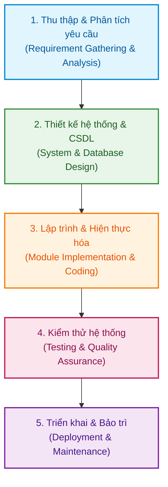
```mermaid
flowchart TD
    A["1. Thu thập & Phân tích yêu cầu<br/>(Requirement Gathering & Analysis)"] --> B["2. Thiết kế hệ thống & CSDL<br/>(System & Database Design)"]
    B --> C["3. Lập trình & Hiện thực hóa<br/>(Module Implementation & Coding)"]
    C --> D["4. Kiểm thử hệ thống<br/>(Testing & Quality Assurance)"]
    D --> E["5. Triển khai & Bảo trì<br/>(Deployment & Maintenance)"]

    style A fill:#e1f5fe,stroke:#0288d1,stroke-width:2px,color:#01579b
    style B fill:#e8f5e9,stroke:#388e3c,stroke-width:2px,color:#1b5e20
    style C fill:#fff3e0,stroke:#f57c00,stroke-width:2px,color:#e65100
    style D fill:#fce4ec,stroke:#c2185b,stroke-width:2px,color:#880e4f
    style E fill:#f3e5f5,stroke:#7b1fa2,stroke-width:2px,color:#4a148c
```

---

## CHƯƠNG 2: HỆ THỐNG SƠ ĐỒ USE CASE (UML)

### Hình 2.1: Sơ đồ Use Case tổng quát

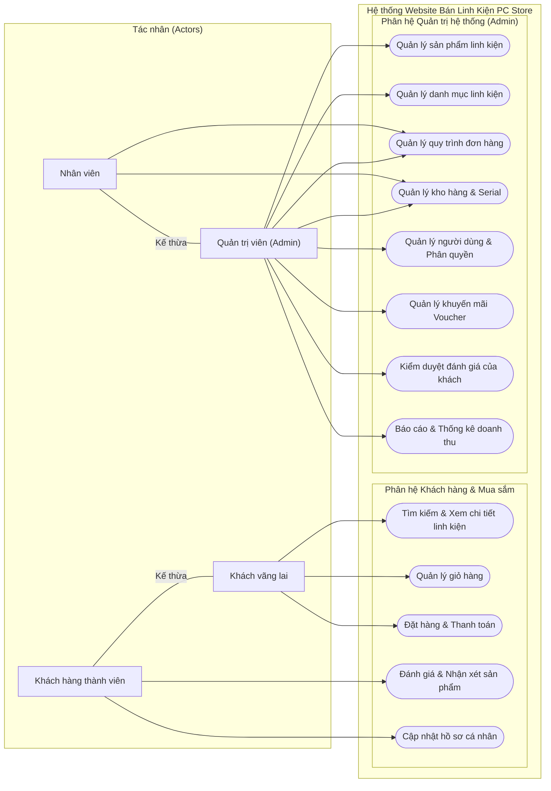
```mermaid
flowchart LR
    subgraph Actors["Tác nhân (Actors)"]
        Guest["Khách vãng lai"]
        Customer["Khách hàng thành viên"]
        Admin["Quản trị viên (Admin)"]
        Staff["Nhân viên"]
    end

    Customer ---|Kế thừa| Guest
    Staff ---|Kế thừa| Admin

    subgraph System["Hệ thống Website Bán Linh Kiện PC Store"]
        subgraph GroupGuest["Phân hệ Khách hàng & Mua sắm"]
            UC_Search(["Tìm kiếm & Xem chi tiết linh kiện"])
            UC_Cart(["Quản lý giỏ hàng"])
            UC_Order(["Đặt hàng & Thanh toán"])
            UC_Review(["Đánh giá & Nhận xét sản phẩm"])
            UC_Profile(["Cập nhật hồ sơ cá nhân"])
        end

        subgraph GroupAdmin["Phân hệ Quản trị hệ thống (Admin)"]
            UC_MngProduct(["Quản lý sản phẩm linh kiện"])
            UC_MngCategory(["Quản lý danh mục linh kiện"])
            UC_MngOrder(["Quản lý quy trình đơn hàng"])
            UC_MngInventory(["Quản lý kho hàng & Serial"])
            UC_MngUser(["Quản lý người dùng & Phân quyền"])
            UC_MngCoupon(["Quản lý khuyến mãi Voucher"])
            UC_MngReview(["Kiểm duyệt đánh giá của khách"])
            UC_Dashboard(["Báo cáo & Thống kê doanh thu"])
        end
    end

    Guest --> UC_Search
    Guest --> UC_Cart
    Guest --> UC_Order

    Customer --> UC_Review
    Customer --> UC_Profile

    Admin --> UC_MngProduct
    Admin --> UC_MngCategory
    Admin --> UC_MngOrder
    Admin --> UC_MngInventory
    Admin --> UC_MngUser
    Admin --> UC_MngCoupon
    Admin --> UC_MngReview
    Admin --> UC_Dashboard

    Staff --> UC_MngOrder
    Staff --> UC_MngInventory
```

---

### Hình 2.2: Sơ đồ Use Case đặt hàng

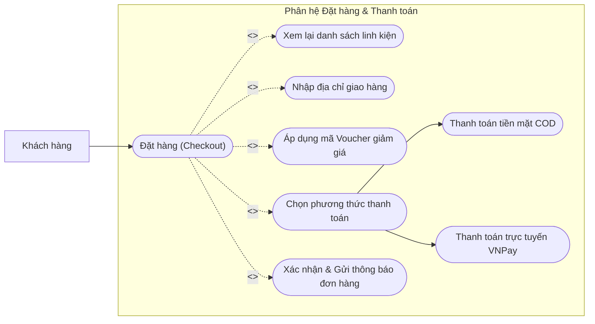
```mermaid
flowchart LR
    Customer["Khách hàng"]

    subgraph OrderSystem["Phân hệ Đặt hàng & Thanh toán"]
        UC_Checkout(["Đặt hàng (Checkout)"])
        UC_ViewCart(["Xem lại danh sách linh kiện"])
        UC_FillAddress(["Nhập địa chỉ giao hàng"])
        UC_ApplyCoupon(["Áp dụng mã Voucher giảm giá"])
        UC_ChoosePayment(["Chọn phương thức thanh toán"])
        UC_PayCOD(["Thanh toán tiền mặt COD"])
        UC_PayVNPay(["Thanh toán trực tuyến VNPay"])
        UC_ConfirmOrder(["Xác nhận & Gửi thông báo đơn hàng"])
    end

    Customer --> UC_Checkout
    UC_Checkout -.->|"<<include>>"| UC_ViewCart
    UC_Checkout -.->|"<<include>>"| UC_FillAddress
    UC_Checkout -.->|"<<extend>>"| UC_ApplyCoupon
    UC_Checkout -.->|"<<include>>"| UC_ChoosePayment
    UC_ChoosePayment --> UC_PayCOD
    UC_ChoosePayment --> UC_PayVNPay
    UC_Checkout -.->|"<<include>>"| UC_ConfirmOrder
```

---

### Hình 2.3: Sơ đồ Use Case giỏ hàng

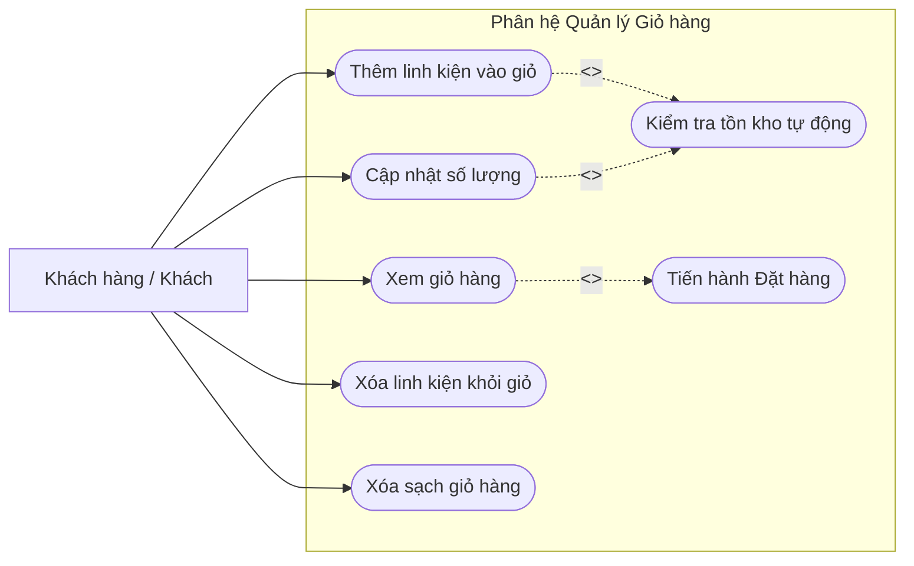
```mermaid
flowchart LR
    Customer["Khách hàng / Khách"]

    subgraph CartSystem["Phân hệ Quản lý Giỏ hàng"]
        UC_AddCart(["Thêm linh kiện vào giỏ"])
        UC_ViewCart(["Xem giỏ hàng"])
        UC_UpdateQty(["Cập nhật số lượng"])
        UC_RemoveItem(["Xóa linh kiện khỏi giỏ"])
        UC_ClearCart(["Xóa sạch giỏ hàng"])
        UC_CheckStock(["Kiểm tra tồn kho tự động"])
        UC_GoCheckout(["Tiến hành Đặt hàng"])
    end

    Customer --> UC_AddCart
    Customer --> UC_ViewCart
    Customer --> UC_UpdateQty
    Customer --> UC_RemoveItem
    Customer --> UC_ClearCart

    UC_AddCart -.->|"<<include>>"| UC_CheckStock
    UC_UpdateQty -.->|"<<include>>"| UC_CheckStock
    UC_ViewCart -.->|"<<extend>>"| UC_GoCheckout
```

---

### Hình 2.4: Sơ đồ Use Case đánh giá

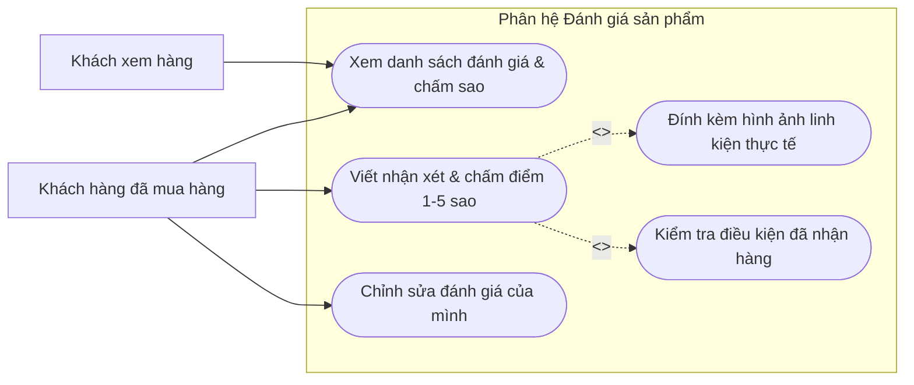
```mermaid
flowchart LR
    Customer["Khách hàng đã mua hàng"]
    Guest["Khách xem hàng"]

    subgraph ReviewSystem["Phân hệ Đánh giá sản phẩm"]
        UC_ViewReviews(["Xem danh sách đánh giá & chấm sao"])
        UC_WriteReview(["Viết nhận xét & chấm điểm 1-5 sao"])
        UC_UploadImg(["Đính kèm hình ảnh linh kiện thực tế"])
        UC_EditReview(["Chỉnh sửa đánh giá của mình"])
        UC_CheckPurchased(["Kiểm tra điều kiện đã nhận hàng"])
    end

    Guest --> UC_ViewReviews
    Customer --> UC_ViewReviews
    Customer --> UC_WriteReview
    Customer --> UC_EditReview

    UC_WriteReview -.->|"<<include>>"| UC_CheckPurchased
    UC_WriteReview -.->|"<<extend>>"| UC_UploadImg
```

---

### Hình 2.5: Sơ đồ Use Case quản lý sản phẩm

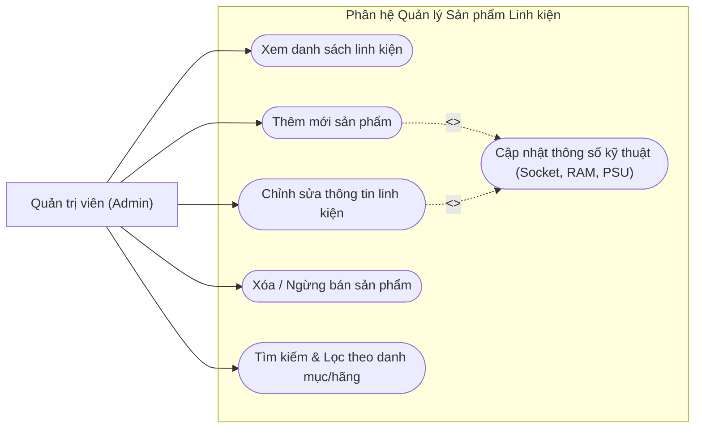
```mermaid
flowchart LR
    Admin["Quản trị viên (Admin)"]

    subgraph ProductSystem["Phân hệ Quản lý Sản phẩm Linh kiện"]
        UC_ViewList(["Xem danh sách linh kiện"])
        UC_AddProduct(["Thêm mới sản phẩm"])
        UC_EditProduct(["Chỉnh sửa thông tin linh kiện"])
        UC_DelProduct(["Xóa / Ngừng bán sản phẩm"])
        UC_Spec(["Cập nhật thông số kỹ thuật (Socket, RAM, PSU)"])
        UC_Filter(["Tìm kiếm & Lọc theo danh mục/hãng"])
    end

    Admin --> UC_ViewList
    Admin --> UC_AddProduct
    Admin --> UC_EditProduct
    Admin --> UC_DelProduct
    Admin --> UC_Filter

    UC_AddProduct -.->|"<<include>>"| UC_Spec
    UC_EditProduct -.->|"<<include>>"| UC_Spec
```

---

### Hình 2.6: Sơ đồ Use Case quản lý danh mục

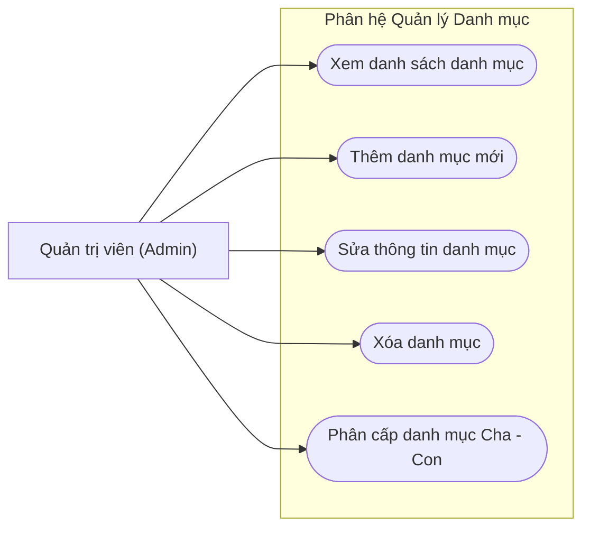
```mermaid
flowchart LR
    Admin["Quản trị viên (Admin)"]

    subgraph CategorySystem["Phân hệ Quản lý Danh mục"]
        UC_ViewCat(["Xem danh sách danh mục"])
        UC_AddCat(["Thêm danh mục mới"])
        UC_EditCat(["Sửa thông tin danh mục"])
        UC_DelCat(["Xóa danh mục"])
        UC_SortCat(["Phân cấp danh mục Cha - Con"])
    end

    Admin --> UC_ViewCat
    Admin --> UC_AddCat
    Admin --> UC_EditCat
    Admin --> UC_DelCat
    Admin --> UC_SortCat
```

---

### Hình 2.7: Sơ đồ Use Case quản lý kho hàng

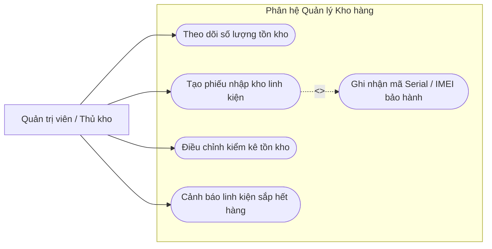
```mermaid
flowchart LR
    Admin["Quản trị viên / Thủ kho"]

    subgraph InventorySystem["Phân hệ Quản lý Kho hàng"]
        UC_ViewStock(["Theo dõi số lượng tồn kho"])
        UC_ImportStock(["Tạo phiếu nhập kho linh kiện"])
        UC_ManageSerial(["Ghi nhận mã Serial / IMEI bảo hành"])
        UC_AdjustStock(["Điều chỉnh kiểm kê tồn kho"])
        UC_AlertLow(["Cảnh báo linh kiện sắp hết hàng"])
    end

    Admin --> UC_ViewStock
    Admin --> UC_ImportStock
    Admin --> UC_AdjustStock
    Admin --> UC_AlertLow

    UC_ImportStock -.->|"<<include>>"| UC_ManageSerial
```

---

### Hình 2.8: Sơ đồ Use Case quản lý đơn hàng

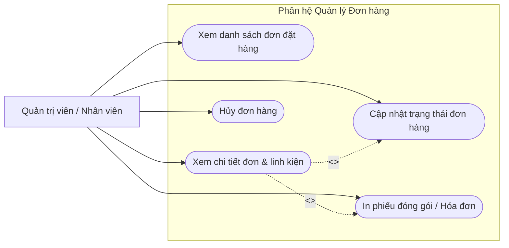
```mermaid
flowchart LR
    Admin["Quản trị viên / Nhân viên"]

    subgraph OrderMngSystem["Phân hệ Quản lý Đơn hàng"]
        UC_ListOrders(["Xem danh sách đơn đặt hàng"])
        UC_ViewDetail(["Xem chi tiết đơn & linh kiện"])
        UC_UpdateStatus(["Cập nhật trạng thái đơn hàng"])
        UC_PrintInvoice(["In phiếu đóng gói / Hóa đơn"])
        UC_CancelOrder(["Hủy đơn hàng"])
    end

    Admin --> UC_ListOrders
    Admin --> UC_ViewDetail
    Admin --> UC_UpdateStatus
    Admin --> UC_PrintInvoice
    Admin --> UC_CancelOrder

    UC_ViewDetail -.->|"<<extend>>"| UC_UpdateStatus
    UC_ViewDetail -.->|"<<extend>>"| UC_PrintInvoice
```

---

### Hình 2.9: Sơ đồ Use Case quản lý người dùng

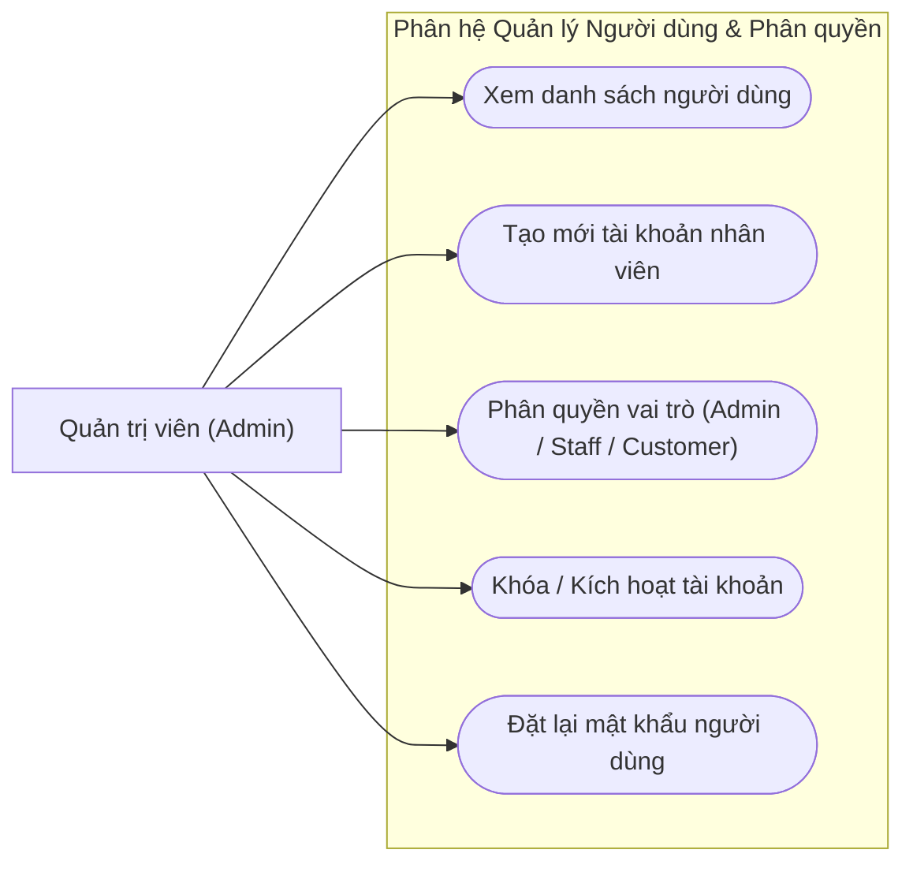
```mermaid
flowchart LR
    Admin["Quản trị viên (Admin)"]

    subgraph UserMngSystem["Phân hệ Quản lý Người dùng & Phân quyền"]
        UC_ListUsers(["Xem danh sách người dùng"])
        UC_AddUser(["Tạo mới tài khoản nhân viên"])
        UC_EditRole(["Phân quyền vai trò (Admin / Staff / Customer)"])
        UC_LockUser(["Khóa / Kích hoạt tài khoản"])
        UC_ResetPass(["Đặt lại mật khẩu người dùng"])
    end

    Admin --> UC_ListUsers
    Admin --> UC_AddUser
    Admin --> UC_EditRole
    Admin --> UC_LockUser
    Admin --> UC_ResetPass
```

---

### Hình 2.10: Sơ đồ Use Case quản lý khuyến mãi

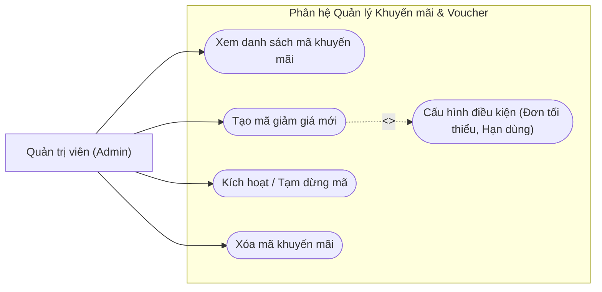
```mermaid
flowchart LR
    Admin["Quản trị viên (Admin)"]

    subgraph CouponMngSystem["Phân hệ Quản lý Khuyến mãi & Voucher"]
        UC_ListCoupons(["Xem danh sách mã khuyến mãi"])
        UC_CreateCoupon(["Tạo mã giảm giá mới"])
        UC_ConfigRules(["Cấu hình điều kiện (Đơn tối thiểu, Hạn dùng)"])
        UC_ToggleCoupon(["Kích hoạt / Tạm dừng mã"])
        UC_DeleteCoupon(["Xóa mã khuyến mãi"])
    end

    Admin --> UC_ListCoupons
    Admin --> UC_CreateCoupon
    Admin --> UC_ToggleCoupon
    Admin --> UC_DeleteCoupon

    UC_CreateCoupon -.->|"<<include>>"| UC_ConfigRules
```

---

### Hình 2.11: Sơ đồ Use Case quản lý đánh giá (Admin)

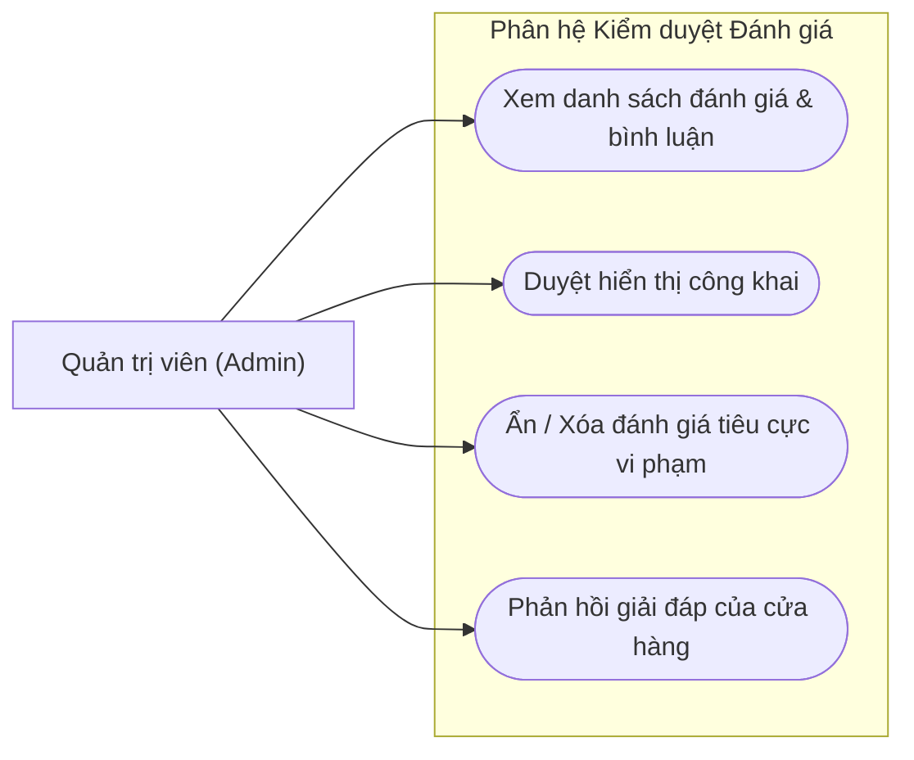
```mermaid
flowchart LR
    Admin["Quản trị viên (Admin)"]

    subgraph ReviewMngSystem["Phân hệ Kiểm duyệt Đánh giá"]
        UC_ListReviews(["Xem danh sách đánh giá & bình luận"])
        UC_ApproveReview(["Duyệt hiển thị công khai"])
        UC_HideReview(["Ẩn / Xóa đánh giá tiêu cực vi phạm"])
        UC_ReplyReview(["Phản hồi giải đáp của cửa hàng"])
    end

    Admin --> UC_ListReviews
    Admin --> UC_ApproveReview
    Admin --> UC_HideReview
    Admin --> UC_ReplyReview
```

---

## CHƯƠNG 2: HỆ THỐNG SƠ ĐỒ TUẦN TỰ (SEQUENCE DIAGRAM)
*(Xây dựng chuẩn theo mô hình 4 tầng BCE: Actor $\rightarrow$ Boundary $\rightarrow$ Controller $\rightarrow$ Entity/Database)*

### Hình 2.12: Sơ đồ tuần tự đăng ký

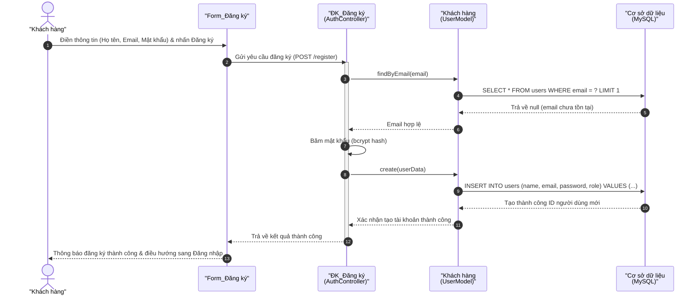
```mermaid
sequenceDiagram
    autonumber
    actor KH as "Khách hàng"
    participant V as "Form_Đăng ký"
    participant C as "ĐK_Đăng ký<br/>(AuthController)"
    participant E as "Khách hàng<br/>(UserModel)"
    participant DB as "Cơ sở dữ liệu<br/>(MySQL)"

    KH ->> V: Điền thông tin (Họ tên, Email, Mật khẩu) & nhấn Đăng ký
    V ->> C: Gửi yêu cầu đăng ký (POST /register)
    activate C
    C ->> E: findByEmail(email)
    E ->> DB: SELECT * FROM users WHERE email = ? LIMIT 1
    DB -->> E: Trả về null (email chưa tồn tại)
    E -->> C: Email hợp lệ
    C ->> C: Băm mật khẩu (bcrypt hash)
    C ->> E: create(userData)
    E ->> DB: INSERT INTO users (name, email, password, role) VALUES (...)
    DB -->> E: Tạo thành công ID người dùng mới
    E -->> C: Xác nhận tạo tài khoản thành công
    C -->> V: Trả về kết quả thành công
    deactivate C
    V -->> KH: Thông báo đăng ký thành công & điều hướng sang Đăng nhập
```

---

### Hình 2.13: Sơ đồ tuần tự đăng nhập

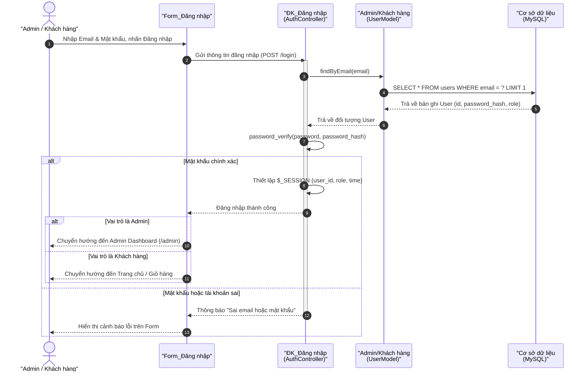
```mermaid
sequenceDiagram
    autonumber
    actor U as "Admin / Khách hàng"
    participant V as "Form_Đăng nhập"
    participant C as "ĐK_Đăng nhập<br/>(AuthController)"
    participant E as "Admin/Khách hàng<br/>(UserModel)"
    participant DB as "Cơ sở dữ liệu<br/>(MySQL)"

    U ->> V: Nhập Email & Mật khẩu, nhấn Đăng nhập
    V ->> C: Gửi thông tin đăng nhập (POST /login)
    activate C
    C ->> E: findByEmail(email)
    E ->> DB: SELECT * FROM users WHERE email = ? LIMIT 1
    DB -->> E: Trả về bản ghi User (id, password_hash, role)
    E -->> C: Trả về đối tượng User
    C ->> C: password_verify(password, password_hash)
    alt Mật khẩu chính xác
        C ->> C: Thiết lập $_SESSION (user_id, role, time)
        C -->> V: Đăng nhập thành công
        alt Vai trò là Admin
            V -->> U: Chuyển hướng đến Admin Dashboard (/admin)
        else Vai trò là Khách hàng
            V -->> U: Chuyển hướng đến Trang chủ / Giỏ hàng
        end
    else Mật khẩu hoặc tài khoản sai
        C -->> V: Thông báo "Sai email hoặc mật khẩu"
        deactivate C
        V -->> U: Hiển thị cảnh báo lỗi trên Form
    end
```

---

### Hình 2.14: Sơ đồ tuần tự quản lý sản phẩm

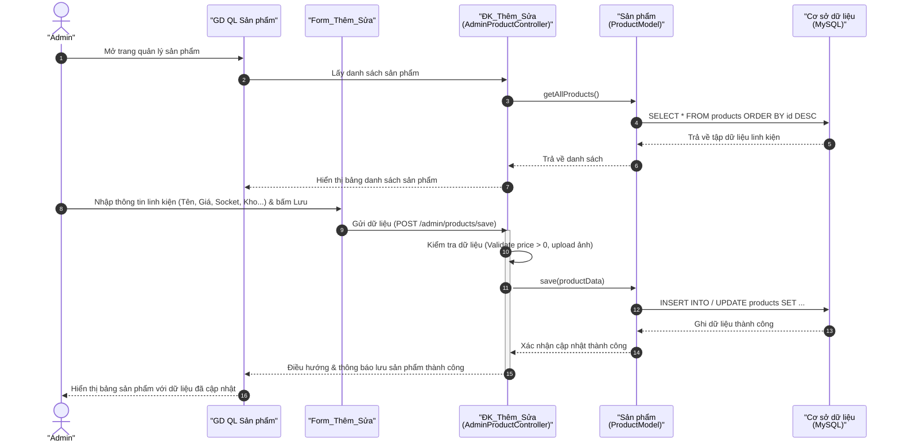
```mermaid
sequenceDiagram
    autonumber
    actor A as "Admin"
    participant V1 as "GD QL Sản phẩm"
    participant V2 as "Form_Thêm_Sửa"
    participant C as "ĐK_Thêm_Sửa<br/>(AdminProductController)"
    participant E as "Sản phẩm<br/>(ProductModel)"
    participant DB as "Cơ sở dữ liệu<br/>(MySQL)"

    A ->> V1: Mở trang quản lý sản phẩm
    V1 ->> C: Lấy danh sách sản phẩm
    C ->> E: getAllProducts()
    E ->> DB: SELECT * FROM products ORDER BY id DESC
    DB -->> E: Trả về tập dữ liệu linh kiện
    E -->> C: Trả về danh sách
    C -->> V1: Hiển thị bảng danh sách sản phẩm

    A ->> V2: Nhập thông tin linh kiện (Tên, Giá, Socket, Kho...) & bấm Lưu
    V2 ->> C: Gửi dữ liệu (POST /admin/products/save)
    activate C
    C ->> C: Kiểm tra dữ liệu (Validate price > 0, upload ảnh)
    C ->> E: save(productData)
    E ->> DB: INSERT INTO / UPDATE products SET ...
    DB -->> E: Ghi dữ liệu thành công
    E -->> C: Xác nhận cập nhật thành công
    C -->> V1: Điều hướng & thông báo lưu sản phẩm thành công
    deactivate C
    V1 -->> A: Hiển thị bảng sản phẩm với dữ liệu đã cập nhật
```

---

### Hình 2.15: Sơ đồ tuần tự quản lý danh mục sản phẩm

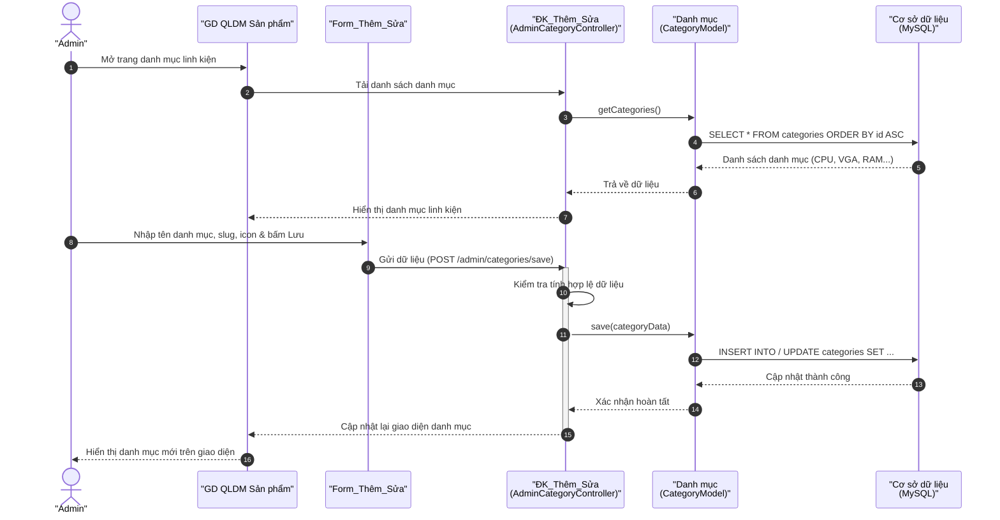
```mermaid
sequenceDiagram
    autonumber
    actor A as "Admin"
    participant V1 as "GD QLDM Sản phẩm"
    participant V2 as "Form_Thêm_Sửa"
    participant C as "ĐK_Thêm_Sửa<br/>(AdminCategoryController)"
    participant E as "Danh mục<br/>(CategoryModel)"
    participant DB as "Cơ sở dữ liệu<br/>(MySQL)"

    A ->> V1: Mở trang danh mục linh kiện
    V1 ->> C: Tải danh sách danh mục
    C ->> E: getCategories()
    E ->> DB: SELECT * FROM categories ORDER BY id ASC
    DB -->> E: Danh sách danh mục (CPU, VGA, RAM...)
    E -->> C: Trả về dữ liệu
    C -->> V1: Hiển thị danh mục linh kiện

    A ->> V2: Nhập tên danh mục, slug, icon & bấm Lưu
    V2 ->> C: Gửi dữ liệu (POST /admin/categories/save)
    activate C
    C ->> C: Kiểm tra tính hợp lệ dữ liệu
    C ->> E: save(categoryData)
    E ->> DB: INSERT INTO / UPDATE categories SET ...
    DB -->> E: Cập nhật thành công
    E -->> C: Xác nhận hoàn tất
    C -->> V1: Cập nhật lại giao diện danh mục
    deactivate C
    V1 -->> A: Hiển thị danh mục mới trên giao diện
```

---

### Hình 2.16: Sơ đồ tuần tự quản lý người dùng

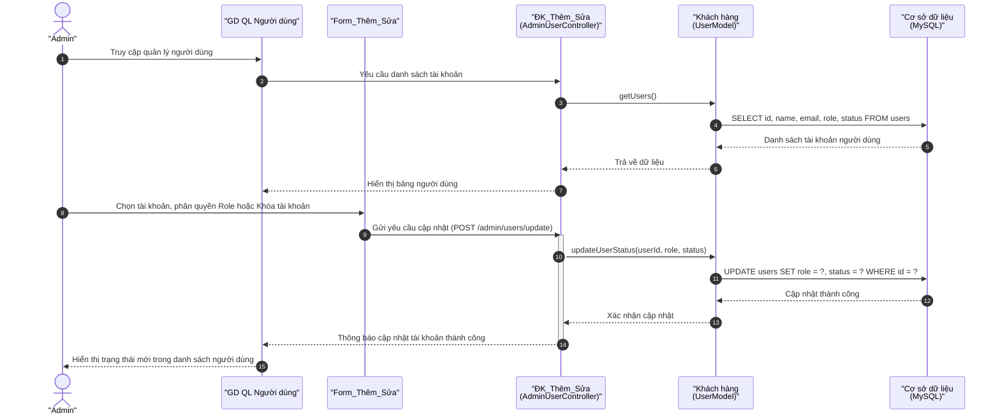
```mermaid
sequenceDiagram
    autonumber
    actor A as "Admin"
    participant V1 as "GD QL Người dùng"
    participant V2 as "Form_Thêm_Sửa"
    participant C as "ĐK_Thêm_Sửa<br/>(AdminUserController)"
    participant E as "Khách hàng<br/>(UserModel)"
    participant DB as "Cơ sở dữ liệu<br/>(MySQL)"

    A ->> V1: Truy cập quản lý người dùng
    V1 ->> C: Yêu cầu danh sách tài khoản
    C ->> E: getUsers()
    E ->> DB: SELECT id, name, email, role, status FROM users
    DB -->> E: Danh sách tài khoản người dùng
    E -->> C: Trả về dữ liệu
    C -->> V1: Hiển thị bảng người dùng

    A ->> V2: Chọn tài khoản, phân quyền Role hoặc Khóa tài khoản
    V2 ->> C: Gửi yêu cầu cập nhật (POST /admin/users/update)
    activate C
    C ->> E: updateUserStatus(userId, role, status)
    E ->> DB: UPDATE users SET role = ?, status = ? WHERE id = ?
    DB -->> E: Cập nhật thành công
    E -->> C: Xác nhận cập nhật
    C -->> V1: Thông báo cập nhật tài khoản thành công
    deactivate C
    V1 -->> A: Hiển thị trạng thái mới trong danh sách người dùng
```

---

### Hình 2.17: Sơ đồ tuần tự thống kê doanh thu

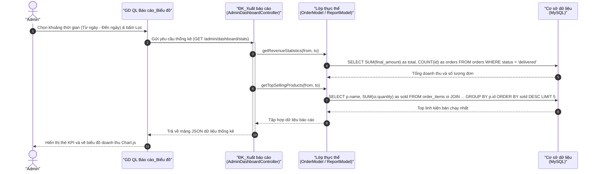
```mermaid
sequenceDiagram
    autonumber
    actor A as "Admin"
    participant V as "GD QL Báo cáo_Biểu đồ"
    participant C as "ĐK_Xuất báo cáo<br/>(AdminDashboardController)"
    participant E as "Lớp thực thể<br/>(OrderModel / ReportModel)"
    participant DB as "Cơ sở dữ liệu<br/>(MySQL)"

    A ->> V: Chọn khoảng thời gian (Từ ngày - Đến ngày) & bấm Lọc
    V ->> C: Gửi yêu cầu thống kê (GET /admin/dashboard/stats)
    activate C
    C ->> E: getRevenueStatistics(from, to)
    E ->> DB: SELECT SUM(final_amount) as total, COUNT(id) as orders FROM orders WHERE status = 'delivered'
    DB -->> E: Tổng doanh thu và số lượng đơn
    C ->> E: getTopSellingProducts(from, to)
    E ->> DB: SELECT p.name, SUM(oi.quantity) as sold FROM order_items oi JOIN ... GROUP BY p.id ORDER BY sold DESC LIMIT 5
    DB -->> E: Top linh kiện bán chạy nhất
    E -->> C: Tập hợp dữ liệu báo cáo
    C -->> V: Trả về mảng JSON dữ liệu thống kê
    deactivate C
    V -->> A: Hiển thị thẻ KPI và vẽ biểu đồ doanh thu Chart.js
```

---

### Hình 2.18: Sơ đồ tuần tự quản lý đơn hàng

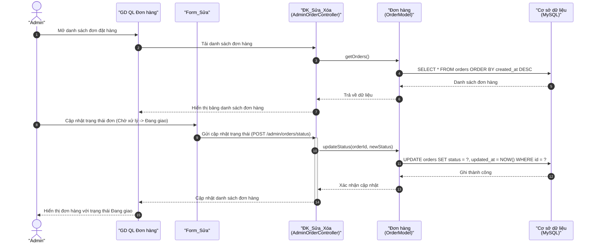
```mermaid
sequenceDiagram
    autonumber
    actor A as "Admin"
    participant V1 as "GD QL Đơn hàng"
    participant V2 as "Form_Sửa"
    participant C as "ĐK_Sửa_Xóa<br/>(AdminOrderController)"
    participant E as "Đơn hàng<br/>(OrderModel)"
    participant DB as "Cơ sở dữ liệu<br/>(MySQL)"

    A ->> V1: Mở danh sách đơn đặt hàng
    V1 ->> C: Tải danh sách đơn hàng
    C ->> E: getOrders()
    E ->> DB: SELECT * FROM orders ORDER BY created_at DESC
    DB -->> E: Danh sách đơn hàng
    E -->> C: Trả về dữ liệu
    C -->> V1: Hiển thị bảng danh sách đơn hàng

    A ->> V2: Cập nhật trạng thái đơn (Chờ xử lý -> Đang giao)
    V2 ->> C: Gửi cập nhật trạng thái (POST /admin/orders/status)
    activate C
    C ->> E: updateStatus(orderId, newStatus)
    E ->> DB: UPDATE orders SET status = ?, updated_at = NOW() WHERE id = ?
    DB -->> E: Ghi thành công
    E -->> C: Xác nhận cập nhật
    C -->> V1: Cập nhật danh sách đơn hàng
    deactivate C
    V1 -->> A: Hiển thị đơn hàng với trạng thái Đang giao
```

---

### Hình 2.19: Sơ đồ tuần tự quản lý đánh giá

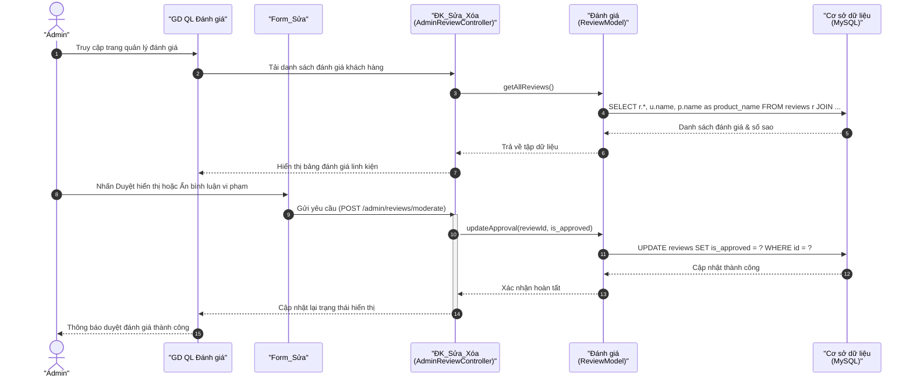
```mermaid
sequenceDiagram
    autonumber
    actor A as "Admin"
    participant V1 as "GD QL Đánh giá"
    participant V2 as "Form_Sửa"
    participant C as "ĐK_Sửa_Xóa<br/>(AdminReviewController)"
    participant E as "Đánh giá<br/>(ReviewModel)"
    participant DB as "Cơ sở dữ liệu<br/>(MySQL)"

    A ->> V1: Truy cập trang quản lý đánh giá
    V1 ->> C: Tải danh sách đánh giá khách hàng
    C ->> E: getAllReviews()
    E ->> DB: SELECT r.*, u.name, p.name as product_name FROM reviews r JOIN ...
    DB -->> E: Danh sách đánh giá & số sao
    E -->> C: Trả về tập dữ liệu
    C -->> V1: Hiển thị bảng đánh giá linh kiện

    A ->> V2: Nhấn Duyệt hiển thị hoặc Ẩn bình luận vi phạm
    V2 ->> C: Gửi yêu cầu (POST /admin/reviews/moderate)
    activate C
    C ->> E: updateApproval(reviewId, is_approved)
    E ->> DB: UPDATE reviews SET is_approved = ? WHERE id = ?
    DB -->> E: Cập nhật thành công
    E -->> C: Xác nhận hoàn tất
    C -->> V1: Cập nhật lại trạng thái hiển thị
    deactivate C
    V1 -->> A: Thông báo duyệt đánh giá thành công
```

---

### Hình 2.20: Sơ đồ tuần tự quản lý khuyến mãi

```mermaid
sequenceDiagram
    autonumber
    actor A as "Admin"
    participant V1 as "GD QL Khuyến mãi"
    participant V2 as "Form_Thêm_Sửa"
    participant C as "ĐK_Thêm_Sửa<br/>(AdminCouponController)"
    participant E as "Khuyến mãi<br/>(CouponModel)"
    participant DB as "Cơ sở dữ liệu<br/>(MySQL)"

    A ->> V1: Truy cập trang quản lý mã giảm giá
    V1 ->> C: Lấy danh sách Voucher
    C ->> E: getCoupons()
    E ->> DB: SELECT * FROM coupons ORDER BY id DESC
    DB -->> E: Danh sách Voucher khuyến mãi
    E -->> C: Trả về dữ liệu
    C -->> V1: Hiển thị bảng mã giảm giá

    A ->> V2: Nhập mã Voucher, mức giảm, đơn tối thiểu & bấm Tạo
    V2 ->> C: Gửi yêu cầu tạo (POST /admin/coupons/save)
    activate C
    C ->> C: Kiểm tra mã trùng lặp & hạn sử dụng hợp lệ
    C ->> E: createCoupon(couponData)
    E ->> DB: INSERT INTO coupons (code, discount_value, min_order_value, end_date) VALUES (...)
    DB -->> E: Lưu voucher thành công
    E -->> C: Trả về xác nhận
    C -->> V1: Làm mới bảng danh sách khuyến mãi
    deactivate C
    V1 -->> A: Hiển thị mã voucher mới trên danh sách
```

---

### Hình 2.21: Sơ đồ tuần tự cập nhật thông tin cá nhân

```mermaid
sequenceDiagram
    autonumber
    actor KH as "Khách hàng"
    participant V as "GD Thông tin cá nhân"
    participant C as "ĐK_Sửa<br/>(UserController)"
    participant E as "Khách hàng<br/>(UserModel)"
    participant DB as "Cơ sở dữ liệu<br/>(MySQL)"

    KH ->> V: Chỉnh sửa Họ tên, Số điện thoại, Địa chỉ nhận hàng
    V ->> C: Gửi thông tin mới (POST /profile/update)
    activate C
    C ->> C: Kiểm tra định dạng số điện thoại & địa chỉ
    C ->> E: updateProfile(userId, profileData)
    E ->> DB: UPDATE users SET name = ?, phone = ?, address = ? WHERE id = ?
    DB -->> E: Cập nhật dữ liệu thành công
    E -->> C: Xác nhận lưu hồ sơ
    C ->> C: Cập nhật thông tin trong $_SESSION
    C -->> V: Trả về thông báo thành công
    deactivate C
    V -->> KH: Hiển thị thông báo "Cập nhật hồ sơ cá nhân thành công"
```

---

### Hình 2.22: Sơ đồ tuần tự quản lý giỏ hàng

```mermaid
sequenceDiagram
    autonumber
    actor KH as "Khách hàng"
    participant V as "GD Trang chi tiết sp"
    participant C as "ĐK_Giỏ hàng<br/>(CartController)"
    participant E as "Giỏ hàng<br/>(CartSession / CartModel)"
    participant DB as "Cơ sở dữ liệu<br/>(MySQL)"

    KH ->> V: Chọn số lượng & bấm "Thêm vào giỏ hàng"
    V ->> C: Gửi yêu cầu (POST /cart/add, {product_id, qty})
    activate C
    C ->> DB: SELECT stock_quantity, price FROM products WHERE id = ?
    DB -->> C: Trả về số lượng tồn kho thực tế
    alt Số lượng yêu cầu <= Tồn kho
        C ->> E: addToCart(product_id, qty, price)
        E ->> E: Lưu trữ linh kiện vào Session Giỏ hàng
        E -->> C: Trả về tổng tiền và tổng số lượng giỏ
        C -->> V: Phản hồi JSON (success = true, count = ...)
        V -->> KH: Cập nhật icon badge giỏ hàng & hiển thị popup thành công
    else Số lượng yêu cầu > Tồn kho
        C -->> V: Phản hồi JSON (success = false, message = "Vượt tồn kho")
        deactivate C
        V -->> KH: Cảnh báo "Kho chỉ còn X sản phẩm"
    end
```

---

### Hình 2.23: Sơ đồ tuần tự tìm kiếm

```mermaid
sequenceDiagram
    autonumber
    actor KH as "Khách hàng"
    participant V as "GD Xem dssp"
    participant C as "ĐK_Tìm kiếm<br/>(SearchController)"
    participant E as "Sản phẩm<br/>(ProductModel)"
    participant DB as "Cơ sở dữ liệu<br/>(MySQL)"

    KH ->> V: Nhập từ khóa (vd: "RTX 4060") hoặc chọn bộ lọc Danh mục/Giá
    V ->> C: Gửi tham số tìm kiếm (GET /search?q=RTX+4060)
    activate C
    C ->> E: searchProducts(keyword, filters)
    E ->> DB: SELECT * FROM products WHERE name LIKE '%RTX 4060%' AND status = 'active'
    DB -->> E: Trả về danh sách linh kiện phù hợp
    E -->> C: Tập dữ liệu sản phẩm tìm được
    C -->> V: Hiển thị kết quả tìm kiếm kèm phân trang
    deactivate C
    V -->> KH: Hiển thị danh sách linh kiện khớp với tiêu chí tìm kiếm
```

---

### Hình 2.24: Sơ đồ tuần tự đánh giá

```mermaid
sequenceDiagram
    autonumber
    actor KH as "Khách hàng"
    participant V as "GD Xem sp"
    participant C as "ĐK_Đánh giá<br/>(ReviewController)"
    participant E as "Đánh giá<br/>(ReviewModel)"
    participant DB as "Cơ sở dữ liệu<br/>(MySQL)"

    KH ->> V: Chọn số sao (1-5★), nhập nội dung đánh giá & bấm Gửi
    V ->> C: Gửi đánh giá (POST /reviews/store)
    activate C
    C ->> DB: Kiểm tra đơn hàng của khách (đã mua và trạng thái 'delivered')
    DB -->> C: Xác thực đủ điều kiện đánh giá
    C ->> E: createReview(userId, productId, rating, comment)
    E ->> DB: INSERT INTO reviews (user_id, product_id, rating, comment, is_approved) VALUES (...)
    DB -->> E: Ghi bản ghi đánh giá thành công
    E -->> C: Xác nhận tạo đánh giá
    C -->> V: Phản hồi thành công
    deactivate C
    V -->> KH: Hiển thị thông báo "Cảm ơn bạn đã đánh giá linh kiện!"
```

---

### Hình 2.25: Sơ đồ tuần tự đặt hàng

```mermaid
sequenceDiagram
    autonumber
    actor KH as "Khách hàng"
    participant V as "GD Thanh toán<br/>(Checkout View)"
    participant C as "ĐK_Đặt hàng<br/>(CheckoutController)"
    participant E as "Đơn hàng<br/>(OrderModel)"
    participant DB as "Cơ sở dữ liệu<br/>(MySQL)"
    participant PG as "Cổng thanh toán<br/>(VNPay Gateway)"

    KH ->> V: Nhập địa chỉ nhận hàng, chọn PTTT (VNPay/COD) & bấm Đặt hàng
    V ->> C: Gửi thông tin đặt hàng (POST /checkout/process)
    activate C
    C ->> DB: Bắt đầu Transaction (START TRANSACTION)
    C ->> DB: Khóa dòng kiểm tra tồn kho (SELECT ... FOR UPDATE)
    alt Đủ số lượng tồn kho
        C ->> E: createOrder(orderData)
        E ->> DB: INSERT INTO orders(...) & INSERT INTO order_items(...)
        C ->> DB: Cập nhật trừ tồn kho (UPDATE products SET stock_quantity = ...)
        C ->> DB: Xác nhận Transaction (COMMIT)
        
        alt Thanh toán VNPay
            C ->> PG: Khởi tạo URL giao dịch VNPay (Mã hóa SHA512)
            PG -->> C: Trả về URL cổng VNPay
            C -->> V: Chuyển hướng trình duyệt sang VNPay
            V -->> KH: Khách hàng quét mã QR / nhập thẻ ATM để thanh toán
        else Thanh toán COD
            C ->> C: Xóa giỏ hàng trong Session
            C -->> V: Chuyển hướng đến trang Đặt hàng thành công
            V -->> KH: Hiển thị thông tin mã đơn hàng & hướng dẫn nhận hàng
        end
    else Không đủ tồn kho linh kiện
        C ->> DB: Hoàn tác Transaction (ROLLBACK)
        C -->> V: Thông báo sản phẩm hết hàng
        deactivate C
        V -->> KH: Cảnh báo "Linh kiện trong giỏ đã hết hàng"
    end
```

---

## CHƯƠNG 2: SƠ ĐỒ CƠ SỞ DỮ LIỆU & KIẾN TRÚC LỚP

### Hình 2.26: Sơ đồ thực thể quan hệ (ERD)

```mermaid
erDiagram
    USERS ||--o{ ORDERS : "places"
    USERS ||--o{ REVIEWS : "writes"
    CATEGORIES ||--o{ PRODUCTS : "contains"
    CATEGORIES ||--o{ CATEGORIES : "parent_of"
    PRODUCTS ||--o{ ORDER_ITEMS : "included_in"
    PRODUCTS ||--o{ REVIEWS : "receives"
    PRODUCTS ||--o{ INVENTORIES : "stocks"
    ORDERS ||--|{ ORDER_ITEMS : "has_details"
    ORDERS }o--o| COUPONS : "applies"

    USERS {
        bigint id PK "Khóa chính"
        string name "Họ và tên"
        string email "Email đăng nhập"
        string password "Mật khẩu mã hóa"
        string phone "Số điện thoại"
        text address "Địa chỉ giao hàng"
        string role "admin | staff | customer"
        string status "active | locked"
        datetime created_at "Ngày tạo"
    }

    CATEGORIES {
        bigint id PK "Khóa chính"
        bigint parent_id FK "Danh mục cha"
        string name "Tên danh mục"
        string slug "Đường dẫn thân thiện"
        text description "Mô tả danh mục"
        boolean is_active "Trạng thái hoạt động"
    }

    PRODUCTS {
        bigint id PK "Khóa chính"
        bigint category_id FK "Thuộc danh mục"
        string name "Tên linh kiện"
        string sku "Mã linh kiện"
        decimal price "Giá niêm yết"
        decimal sale_price "Giá khuyến mãi"
        int stock_quantity "Số lượng tồn kho"
        text technical_specs "Thông số kỹ thuật JSON"
        string image "Ảnh đại diện"
        string status "active | inactive"
    }

    ORDERS {
        bigint id PK "Khóa chính"
        bigint user_id FK "Mã khách hàng"
        bigint coupon_id FK "Mã giảm giá áp dụng"
        string order_code "Mã đơn hàng"
        decimal total_amount "Tổng tiền hàng"
        decimal discount_amount "Tiền giảm voucher"
        decimal shipping_fee "Phí vận chuyển"
        decimal final_amount "Số tiền thực trả"
        string payment_method "cod | vnpay"
        string payment_status "pending | paid | failed"
        string status "pending | processing | shipping | delivered | cancelled"
        datetime created_at "Ngày đặt đơn"
    }

    ORDER_ITEMS {
        bigint id PK "Khóa chính"
        bigint order_id FK "Thuộc đơn hàng"
        bigint product_id FK "Thuộc sản phẩm"
        int quantity "Số lượng mua"
        decimal unit_price "Đơn giá mua"
        decimal total_price "Thành tiền"
        string serial_number "Mã Serial bảo hành"
    }

    REVIEWS {
        bigint id PK "Khóa chính"
        bigint user_id FK "Người đánh giá"
        bigint product_id FK "Sản phẩm được đánh giá"
        int rating "Chấm sao từ 1 đến 5"
        text comment "Nội dung nhận xét"
        boolean is_approved "Trạng thái duyệt"
        datetime created_at "Ngày đánh giá"
    }

    COUPONS {
        bigint id PK "Khóa chính"
        string code "Mã Voucher"
        string discount_type "percentage | fixed_amount"
        decimal discount_value "Giá trị giảm"
        decimal min_order_value "Đơn hàng tối thiểu"
        decimal max_discount "Giảm tối đa"
        date start_date "Ngày bắt đầu"
        date end_date "Ngày kết thúc"
        int usage_limit "Giới hạn lượt dùng"
    }

    INVENTORIES {
        bigint id PK "Khóa chính"
        bigint product_id FK "Linh kiện nhập kho"
        string batch_code "Mã lô hàng"
        int quantity "Số lượng nhập"
        string supplier "Nhà cung cấp"
        date received_date "Ngày nhập kho"
    }
```

---

### Hình 2.27: Sơ đồ lớp phân tích (Class Diagram)

```mermaid
classDiagram
    direction TB

    class Database {
        -PDO pdo
        +getInstance() Database
        +getConnection() PDO
        +query(string sql, array params) PDOStatement
    }

    class User {
        -int id
        -string name
        -string email
        -string password
        -string role
        -string status
        +authenticate(string email, string password) bool
        +register(array data) int
        +updateProfile(int id, array data) bool
        +getAllUsers() array
    }

    class Product {
        -int id
        -int category_id
        -string name
        -string sku
        -float price
        -float sale_price
        -int stock_quantity
        -string technical_specs
        +findById(int id) Product
        +getByCategory(int catId) array
        +checkStock(int id, int qty) bool
        +deductStock(int id, int qty) bool
        +save(array data) bool
    }

    class Category {
        -int id
        -int parent_id
        -string name
        -string slug
        +getAllCategories() array
        +getSubcategories(int parentId) array
        +save(array data) bool
    }

    class Order {
        -int id
        -int user_id
        -string order_code
        -float total_amount
        -float discount_amount
        -float final_amount
        -string payment_method
        -string status
        +createOrder(array orderData, array items) int
        +updateStatus(int orderId, string status) bool
        +getOrderDetails(int orderId) array
        +getRevenueStats(string from, string to) array
    }

    class OrderItem {
        -int id
        -int order_id
        -int product_id
        -int quantity
        -float unit_price
        -string serial_number
        +getItemsByOrder(int orderId) array
    }

    class Cart {
        -array items
        +addItem(int productId, int qty) void
        +updateQty(int productId, int qty) void
        +removeItem(int productId) void
        +clear() void
        +getTotalAmount() float
    }

    class Review {
        -int id
        -int user_id
        -int product_id
        -int rating
        -string comment
        -bool is_approved
        +getByProduct(int productId) array
        +createReview(array data) bool
        +approveReview(int id) bool
    }

    class Coupon {
        -int id
        -string code
        -string discount_type
        -float discount_value
        -float min_order_value
        +validateCoupon(string code, float orderTotal) array
        +applyCoupon(string code, float orderTotal) float
    }

    Database <.. User : uses
    Database <.. Product : uses
    Database <.. Category : uses
    Database <.. Order : uses
    Database <.. Review : uses
    Database <.. Coupon : uses

    User "1" --> "0..*" Order : places
    User "1" --> "0..*" Review : writes
    Category "1" --> "0..*" Product : contains
    Product "1" --> "0..*" OrderItem : part_of
    Order "1" *-- "1..*" OrderItem : contains
    Order "0..1" --> "0..1" Coupon : applies
    Cart --> Product : references
```

---

## PHỤ LỤC MỞ RỘNG: SƠ ĐỒ NGHIỆP VỤ CHUYÊN SÂU

### Phụ lục 1: Sơ đồ tuần tự Thanh toán trực tuyến VNPay

```mermaid
sequenceDiagram
    autonumber
    actor Customer as "Khách hàng"
    participant Web as "Giao diện Website"
    participant OrderCtrl as "OrderController"
    participant VNPayHelper as "VNPay Helper"
    participant VNPayGateway as "Cổng thanh toán VNPay"
    participant DB as "Cơ sở dữ liệu (MySQL)"

    Customer ->> Web: Bấm "Thanh toán qua VNPay"
    Web ->> OrderCtrl: Gửi yêu cầu đặt hàng & thanh toán
    activate OrderCtrl
    OrderCtrl ->> DB: Lưu đơn hàng (status = 'pending', payment_status = 'pending')
    DB -->> OrderCtrl: Trả về order_id
    OrderCtrl ->> VNPayHelper: buildPaymentUrl(order_id, total_amount)
    activate VNPayHelper
    VNPayHelper ->> VNPayHelper: Tạo TxnRef = orderId_timestamp
    VNPayHelper ->> VNPayHelper: Sinh mã băm chữ ký HMAC-SHA512
    VNPayHelper -->> OrderCtrl: Trả về URL thanh toán VNPay
    deactivate VNPayHelper
    OrderCtrl -->> Web: Redirect đến URL VNPay
    deactivate OrderCtrl

    Web ->> VNPayGateway: Khách hàng thao tác chuyển khoản / Quét mã QR
    Customer ->> VNPayGateway: Xác nhận thanh toán OTP / App Ngân hàng
    VNPayGateway -->> Web: Trả kết quả về Return URL (vnp_ResponseCode = 00)
    Web ->> OrderCtrl: Xử lý vnpay_return()
    activate OrderCtrl
    OrderCtrl ->> VNPayHelper: verifySignature(vnp_SecureHash)
    alt Chữ ký hợp lệ & vnp_ResponseCode == "00"
        OrderCtrl ->> DB: Cập nhật payment_status = 'paid', status = 'processing'
        OrderCtrl -->> Web: Hiển thị màn hình "Thanh toán thành công"
        Web -->> Customer: Thông báo mã đơn hàng và hướng dẫn giao hàng
    else Chữ ký sai hoặc thanh toán thất bại
        OrderCtrl ->> DB: Cập nhật payment_status = 'failed'
        OrderCtrl -->> Web: Hiển thị màn hình "Thanh toán thất bại"
        deactivate OrderCtrl
        Web -->> Customer: Thông báo lỗi và cho phép chọn lại PTTT
    end
```

---

### Phụ lục 2: Sơ đồ Activity Quy trình xử lý đơn hàng

```mermaid
flowchart TD
    Start([Khách hàng đặt hàng]) --> CheckStock{Kiểm tra tồn kho?}
    
    CheckStock -- Hết hàng --> CancelOrder[Hủy đơn & Thông báo cho khách] --> EndCancel([Kết thúc - Đơn bị hủy])
    
    CheckStock -- Còn hàng --> CheckPayment{Phương thức thanh toán?}
    
    CheckPayment -- VNPay Trực tuyến --> PayOnline[Chuyển sang Cổng VNPay]
    PayOnline --> PayResult{Thanh toán thành công?}
    PayResult -- Thất bại --> RetryPay[Cho phép thanh toán lại] --> CheckPayment
    PayResult -- Thành công --> UpdatePaid[Cập nhật trạng thái: Đã thanh toán]
    
    CheckPayment -- Tiền mặt COD --> SetPending[Cập nhật trạng thái: Chờ duyệt]
    
    UpdatePaid --> Warehouse[Thủ kho xác nhận & Đóng gói linh kiện]
    SetPending --> AdminConfirm[Admin duyệt đơn] --> Warehouse
    
    Warehouse --> AssignShipper[Giao cho đơn vị vận chuyển]
    AssignShipper --> Shipping[Trạng thái: Đang giao hàng]
    
    Shipping --> DeliverSuccess{Giao hàng thành công?}
    DeliverSuccess -- Khách từ chối nhận --> ReturnStock[Hoàn hàng về kho & Khôi phục số lượng tồn] --> EndFailed([Đơn hàng thất bại])
    DeliverSuccess -- Giao thành công --> Delivered[Cập nhật trạng thái: Đã giao]
    
    Delivered --> ActiveWarranty[Kích hoạt mã bảo hành linh kiện]
    ActiveWarranty --> CustomerReview[Khách hàng đánh giá sản phẩm]
    CustomerReview --> EndSuccess([Đơn hàng hoàn tất])
```

---

### Phụ lục 3: Sơ đồ State Vòng đời đơn hàng

```mermaid
stateDiagram-v2
    [*] --> ChoXuly: Khách hàng đặt đơn hàng

    ChoXuly --> DaXacNhan: Admin / Hệ thống xác nhận đơn
    ChoXuly --> DaHuy: Khách hàng / Admin hủy đơn (hoàn tồn kho)

    DaXacNhan --> DangDongGoi: Kho xuất linh kiện đóng gói
    DangDongGoi --> DangGiaoHang: Bàn giao đơn vị vận chuyển

    DangGiaoHang --> GiaoThanhCong: Khách nhận hàng & ký xác nhận
    DangGiaoHang --> GiaoThatBai: Giao 3 lần không thành công

    GiaoThatBai --> DangHoanHang: Chuyển hoàn về kho
    DangHoanHang --> DaHoanHang: Kho nhận lại linh kiện (cộng tồn kho)

    GiaoThanhCong --> YeuCauDoiTra: Khách yêu cầu đổi/trả trong 7 ngày
    YeuCauDoiTra --> DaDoiTra: Duyệt đổi/trả thành công
    YeuCauDoiTra --> GiaoThanhCong: Từ chối yêu cầu đổi/trả

    GiaoThanhCong --> HoanTat: Quá 7 ngày / Khách đánh giá hài lòng
    DaHuy --> [*]
    DaHoanHang --> [*]
    DaDoiTra --> [*]
    HoanTat --> [*]
```
